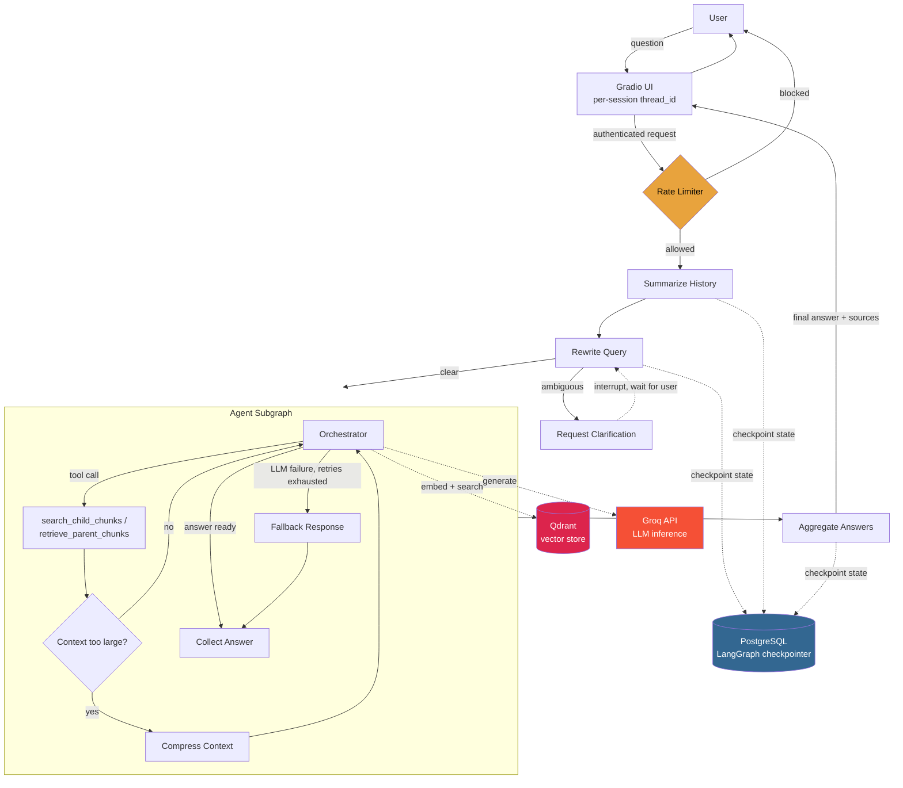

<p align="center">
  
</p>

<h1 align="center">Production Agentic RAG</h1>

<p align="center">
  <strong>A multi-agent RAG system built on LangGraph — hardened from a learning prototype into a deployable, persistent, secured application.</strong>
</p>

<p align="center">
  <a href="#overview">Overview</a> •
  <a href="#architecture">Architecture</a> •
  <a href="#engineering-highlights">Engineering Highlights</a> •
  <a href="#setup">Setup</a> •
  <a href="#project-structure">Project Structure</a> •
  <a href="#known-limitations">Known Limitations</a> •
  <a href="#troubleshooting">Troubleshooting</a>
</p>

<p align="center">
  
  
  
  
  
  
  
</p>

<p align="center">
  <strong>If you like this project, a star ⭐️ would mean a lot :)</strong>
</p>

## Overview

This project answers natural-language questions over a set of indexed PDF documents using a **coordinator-and-subagent LangGraph architecture**: a top-level agent plans and rewrites the query, delegates chunk retrieval and analysis to specialist subagents running in parallel, compresses context to stay within budget, and synthesizes a single, source-cited answer.

It started as a learning prototype and was engineered from there into a real, deployable service — adding persistent state, authentication, rate limiting, resilience against LLM provider failures, and a Docker-based deployment, all verified through hands-on testing.

### Core RAG Features

| Feature | Description |
|---|---|
| 🗂️ **Hierarchical Indexing** | Search small child chunks for precision, retrieve large parent chunks for context |
| 🧠 **Conversation Memory** | Rolling summary + recent history, persisted per session |
| ❓ **Query Clarification** | Human-in-the-loop interrupt when a question is ambiguous |
| 🤖 **Agent Orchestration** | LangGraph coordinates retrieval, reasoning, and synthesis |
| 🔀 **Multi-Agent Map-Reduce** | Parallel subagents per decomposed sub-question |
| ✅ **Self-Correction** | Re-queries automatically when initial retrieval is insufficient |
| 🗜️ **Context Compression** | Keeps working memory lean across long retrieval loops |

### Production Hardening

| Feature | Description |
|---|---|
| 🐘 **Postgres Persistence** | Conversation state survives restarts via `PostgresSaver`, replacing in-memory checkpointers |
| 🔁 **Retry & Fallback** | `tenacity`-based exponential backoff around every LLM call, with graceful degradation instead of crashes |
| 🔐 **Authentication** | Gradio-level username/password auth, failing loud if credentials aren't configured |
| 🚦 **Rate Limiting** | Per-session sliding-window limiter, blocking abuse before it reaches the LLM |
| 🧵 **Session Isolation** | Per-browser-session `thread_id` via `gr.State()` — prevents cross-user conversation bleed |
| 📋 **Structured Logging** | Consistent, leveled logging in place of scattered `print()` calls |
| 🐳 **Docker Deployment** | `docker-compose.yml` running app + Postgres + Qdrant as health-checked services |
| 🧪 **Unit Tests** | Test coverage for document processing and table-of-contents filtering logic |

---

## Architecture



Each incoming question passes through auth and rate limiting before it ever reaches the graph. From there, the same core LangGraph workflow from the prototype handles history summarization, query rewriting/clarification, and parallel agent retrieval — but every stage now checkpoints to Postgres instead of memory, so a restart doesn't lose the conversation.

---

## Engineering Highlights

**Persistent state.** The original in-memory `MemorySaver` checkpointer is replaced with LangGraph's `PostgresSaver`, so conversation threads, pending clarifications, and interrupt state all survive a process restart or redeploy.

**Resilience around the LLM.** Every call to Groq is wrapped in `tenacity`-based retry logic with exponential backoff. When retries are exhausted, the orchestrator routes to a `fallback_response` node instead of raising, so a provider hiccup degrades the answer rather than crashing the session.

**Authentication and abuse protection.** The Gradio app requires configured username/password credentials to boot — it fails loudly rather than serving an open endpoint. A per-session sliding-window rate limiter sits in front of the graph to block abusive request patterns before they ever reach the LLM.

**Session isolation.** Each browser session gets its own `thread_id`, tracked via `gr.State()`, so concurrent users never see each other's conversation history or checkpointed state.

**Observability.** Scattered `print()` debugging from the prototype is replaced with structured, leveled logging, making it possible to trace a request through summarization, rewriting, retrieval, and aggregation.

**Deployment.** `docker-compose.yml` brings up the app alongside Postgres and Qdrant as health-checked services, so the whole stack starts with a single command instead of manual provisioning.

**Testing.** Unit tests cover document processing and table-of-contents filtering — the logic most likely to silently break retrieval quality when documents change shape.

---

## Setup

> **Note:** Model names and pricing change frequently for hosted providers — check [Groq's docs](https://console.groq.com/docs) for current model identifiers before deploying.

### Option 1: Docker Compose (recommended)

```bash
git clone https://github.com/saghri516/production-agentic-rag
cd production-agentic-rag

# Create your environment file
cp .env.example .env   # then fill in the values below
```

Populate `.env` with at least:

```bash
# LLM provider
GROQ_API_KEY=your-groq-api-key

# Postgres (LangGraph checkpointer)
POSTGRES_USER=postgres
POSTGRES_PASSWORD=your-postgres-password
POSTGRES_DB=agentic_rag

# Qdrant
QDRANT_URL=http://qdrant:6333

# Gradio auth (app refuses to start without these)
GRADIO_USERNAME=your-username
GRADIO_PASSWORD=your-password
```

> Treat the variable names above as a starting point — confirm the exact names your app reads against `config.py` / `.env.example` in the repo, since provider and infra settings are the most likely thing to drift as the project evolves.

Then bring up the full stack:

```bash
docker compose up --build
```

This starts the app, Postgres, and Qdrant as health-checked services. Open the local URL printed in the logs (typically `http://127.0.0.1:7860`) and sign in with the credentials you set above.

### Option 2: Manual / local

```bash
git clone https://github.com/saghri516/production-agentic-rag
cd production-agentic-rag

python -m venv .venv && source .venv/bin/activate   # Windows: .venv\Scripts\activate
pip install -r requirements.txt
```

You'll need your own running Postgres and Qdrant instances (or point `docker compose up postgres qdrant` at just those two services and run the app locally against them). Set the same environment variables as above, add your PDFs to `docs/`, then run:

```bash
python project/app.py
```

### Running Tests

```bash
pytest
```

---

## Project Structure

```
production-agentic-rag/
├── assets/                 # Logo and architecture diagram assets
├── docs/                   # Source PDFs to be indexed
├── notebooks/              # Exploratory / prototype notebooks
├── project/                # The application itself
│   ├── app.py               # Gradio entry point, auth, session wiring
│   ├── config.py             # Configuration hub (models, chunk sizes, providers)
│   ├── core/                 # RAG system orchestration
│   ├── db/                   # Vector DB (Qdrant) and Postgres checkpointer
│   ├── rag_agent/             # LangGraph workflow (nodes, edges, prompts, tools)
│   └── ui/                   # Gradio interface, rate limiting, auth
├── Dockerfile
├── docker-compose.yml       # App + Postgres + Qdrant, health-checked
├── requirements.txt
└── LICENSE
```

Key customization points — LLM provider, embedding model, chunking strategy, rate-limit thresholds, and Postgres/Qdrant connection settings — live in `project/config.py` and their respective modules.

---

## Known Limitations

Worth knowing before treating this as a drop-in production deployment:

- **Single LLM provider.** The app is wired to Groq; swapping providers means touching the chat model initialization directly rather than flipping a config flag.
- **Basic auth only.** Access control is a single shared Gradio username/password, not per-user accounts, OAuth, or role-based access.
- **Manual ingestion.** New documents are added by dropping PDFs into `docs/` and re-indexing — there's no ingestion API or admin UI yet.
- **Single-instance rate limiting.** The limiter tracks sessions in-process, so it won't hold up correctly if the app is scaled horizontally behind a load balancer without a shared store.
- **No tracing/observability backend.** Structured logs exist, but there's no integrated tracing (e.g. Langfuse) for inspecting individual LLM calls and tool usage in production.

---

## Troubleshooting

| Area | Common Problems | Suggested Solutions |
|------|----------------|------------------|
| **Startup fails immediately** | App exits before serving | Check that `GRADIO_USERNAME` / `GRADIO_PASSWORD` are set — the app fails loudly rather than starting unauthenticated |
| **Postgres connection errors** | Checkpointer can't connect on startup | Confirm Postgres is healthy (`docker compose ps`) before the app container starts; verify `POSTGRES_*` env vars match the service |
| **Qdrant connection errors** | Retrieval fails or returns empty | Confirm `QDRANT_URL` points at the running Qdrant service/container and the collection has been indexed |
| **LLM calls failing/falling back** | Responses degrade to fallback answers | Check Groq API key validity and rate limits; review retry/backoff logs for the underlying error |
| **429 / rate limited by the app itself** | Legitimate users get blocked | Widen the sliding-window thresholds in the rate limiter config for your expected traffic |
| **Cross-user state bleed** | One user sees another's conversation | Confirm `thread_id` is being read from `gr.State()` per session and not a global/shared variable |
| **Retrieval quality issues** | Irrelevant or fragmented answers | Same tuning levers as the base RAG system — adjust `k`, similarity thresholds, and chunk sizes in `config.py` |
| **Docker Compose services unhealthy** | Containers restart in a loop | Check `docker compose logs <service>` for the failing service; confirm health-check endpoints and startup ordering |